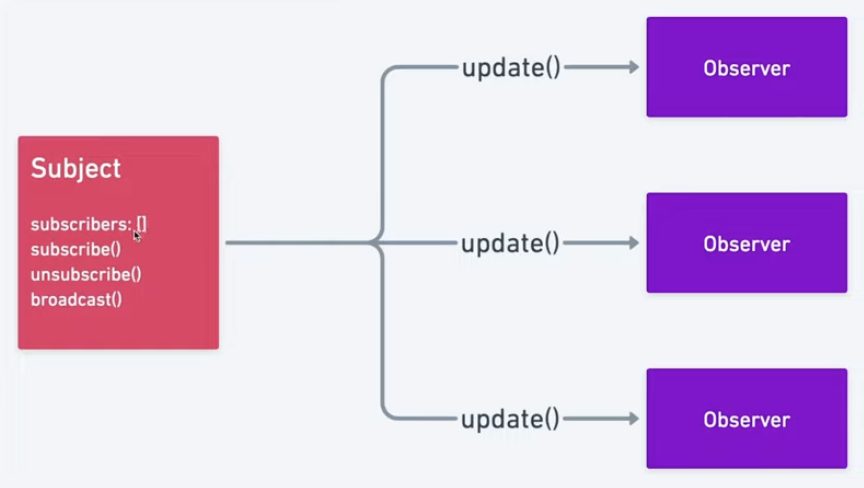

# Design Patterns in JavaScript

## A collection of design patterns implemented in JavaScript

### Observer Pattern

An observer is an object (the subject) that maintains a list of dependents (observers) and notifies them when the state changes, usually by calling a broadcast method

The `addEventListener` DOM API is an example of this.

(See [an example](./observer/simpleFunction.js))

<!-- Add an image below -->

